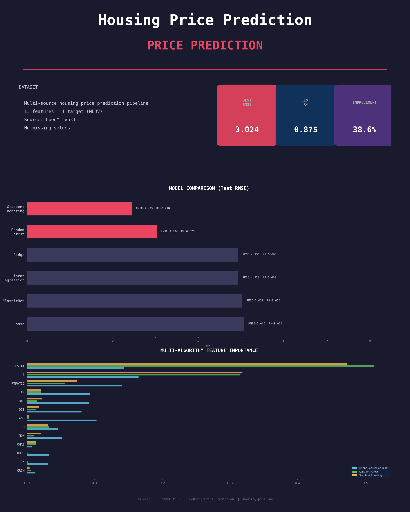

# 房價預測 — 通用機器學習管線

一個可重複使用的房價預測機器學習管線，透過更換 JSON 設定檔即可套用到不同城市/地區。

## 功能特點

- **設定檔驅動**：所有資料集相關參數集中在 `config/*.json`
- **多城市適用**：同一管線可跑 Boston、California、Manhattan 或任何房價資料集
- **完整流程**：EDA、預處理、6 種模型比較、GridSearchCV 調參、Kaggle 提交
- **豐富視覺化**：每次執行產出 10+ 張圖表（相關性熱力圖、殘差、特徵重要性等）
- **海報生成**：學術會議風格摘要海報



## 快速開始

```bash
pip install pandas numpy scikit-learn matplotlib seaborn

# 用任意設定檔執行
python housing_pipeline.py --config config/boston.json

# 生成海報
python generate_poster.py --config config/boston.json
```

## 專案結構

```
.
├── housing_pipeline.py            # 通用管線（讀取設定檔）
├── generate_poster.py             # 通用海報生成器（讀取設定檔）
├── config/
│   ├── boston.json                # Boston 房價（OpenML 來源範例）
│   ├── california.json            # California 房價（sklearn 來源範例）
│   └── manhattan.json             # Manhattan 房價（CSV 來源範例）
├── output/
│   └── {city}/
│       ├── images/                # 所有產出圖表
│       └── submission.csv         # Kaggle 格式預測結果
├── report.md                      # 分析報告範本
└── workflow.md                    # 詳細流程說明
```

## 如何新增一個城市

### 1. 建立設定檔

複製最接近的既有設定檔並修改：

```bash
cp config/manhattan.json config/{city}.json
```

### 2. 編輯設定檔內容

```json
{
  "project_name": "{城市} 房價",
  "project_slug": "{city}-housing",
  "data": {
    "source": "csv | openml | sklearn",
    "csv_path": "data/{city}.csv",
    "target_column": "price",
    "target_display": "Price",
    "target_desc": "住宅中位數價格",
    "target_unit": "$",
    "dataset_source": "資料來源名稱",
    "dataset_desc": "資料集簡述"
  },
  "output": {
    "dir": "output/{city}",
    "submission_target_col": "price"
  }
}
```

詳細欄位說明見下方設定檔參考。

### 3. 執行

```bash
python housing_pipeline.py --config config/{city}.json
python generate_poster.py --config config/{city}.json
```

## 設定檔欄位說明

| 欄位 | 必填 | 說明 |
|-------|------|------|
| `project_name` | 是 | 圖表與輸出使用的專案名稱 |
| `project_slug` | 是 | 用於路徑的簡短識別名稱 |
| `data.source` | 是 | `"openml"`、`"sklearn"` 或 `"csv"` |
| `data.target_column` | 是 | 目標變數的欄位名稱 |
| `data.openml_name` | source=openml 時 | OpenML 資料集名稱 |
| `data.openml_version` | source=openml 時 | OpenML 資料集版本（預設 1） |
| `data.sklearn_name` | source=sklearn 時 | sklearn 資料集名稱（目前支援 `california_housing`） |
| `data.csv_path` | source=csv 時 | CSV 檔案路徑 |
| `data.target_display` | 否 | 圖表中目標變數的顯示名稱（預設用 target_column） |
| `data.target_desc` | 否 | 終端輸出用的描述文字 |
| `data.target_unit` | 否 | 單位字串（例如 "$1000s"） |
| `visualization.fit_line_features` | 否 | 擬合線圖要畫的特徵清單（預設取相關性最高的前 2 個） |
| `visualization.top_features_count` | 否 | 散佈圖顯示的特徵數量（預設 4） |
| `training.test_size` | 否 | 測試集分割比例（預設 0.2） |
| `training.random_state` | 否 | 隨機種子（預設 42） |
| `training.cv_folds` | 否 | 交叉驗證折數（預設 5） |
| `models.rf_tune` | 否 | Random Forest GridSearchCV 參數範圍 |
| `output.dir` | 是 | 本次執行的輸出目錄 |
| `output.submission_id_col` | 否 | 提交檔案的 ID 欄位名稱（預設 "ID"） |
| `output.submission_target_col` | 否 | 提交檔案的預測值欄位名稱（預設同 target_column） |

## 三種資料來源

| 來源 | `source` 值 | 必要欄位 | 適用情境 |
|------|------------|----------|----------|
| OpenML | `"openml"` | `openml_name` | 標準公開資料集（如 Boston） |
| sklearn | `"sklearn"` | `sklearn_name` | sklearn 內建資料集（如 California Housing） |
| 本地 CSV | `"csv"` | `csv_path` | 自己收集的資料 |

**CSV 格式要求**：第一行為欄位名稱，數值型特徵欄位 + 一個目標變數欄位（不需要 ID 欄），欄位順序不拘。

**sklearn 擴充**：若需新增 sklearn 資料集，在 `housing_pipeline.py` 和 `generate_poster.py` 的 `sklearn_fetchers` 字典中加入對應的 fetch 函式即可。

## 執行結果（範例 1：Boston Housing）

| 模型 | RMSE | R² |
|-------|------|-----|
| Gradient Boosting | 2.445 | 0.918 |
| Random Forest | 2.915 | 0.884 |
| Ridge | 4.931 | 0.668 |
| Linear Regression | 4.929 | 0.669 |
| ElasticNet | 5.020 | 0.656 |
| Lasso | 5.065 | 0.650 |

**最佳模型**：調參後的 Random Forest — Test RMSE 3.024、R² 0.875，相較基準模型改善 38.64%。

## 執行結果（範例 2：California Housing）

- 20,640 筆樣本、8 個特徵
- Linear Regression baseline：RMSE 0.746、R² 0.576
- **最佳模型（Tuned RF）**：RMSE 0.504、R² 0.806，改善 **32.44%**

> 其餘城市的執行結果請參考各自 `output/{city}/` 目錄下的輸出。
