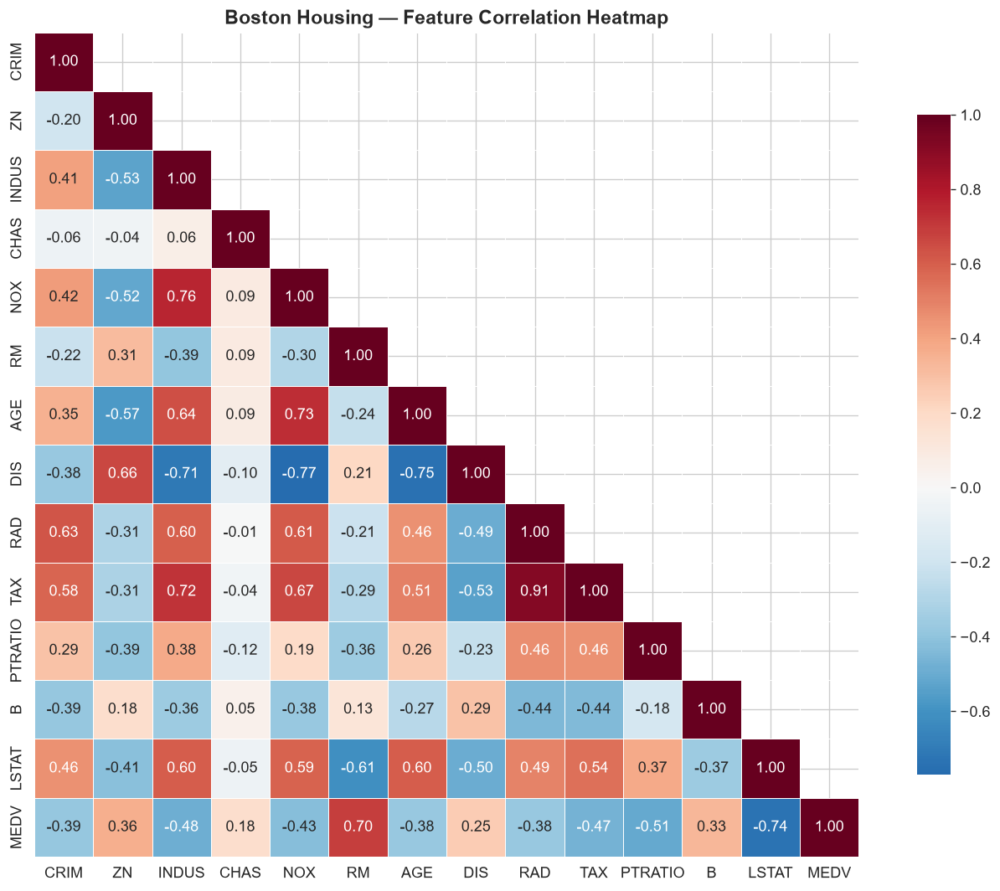
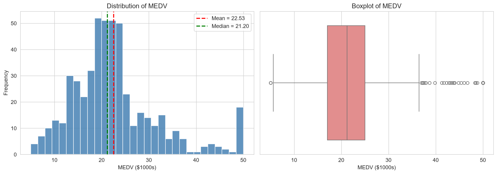
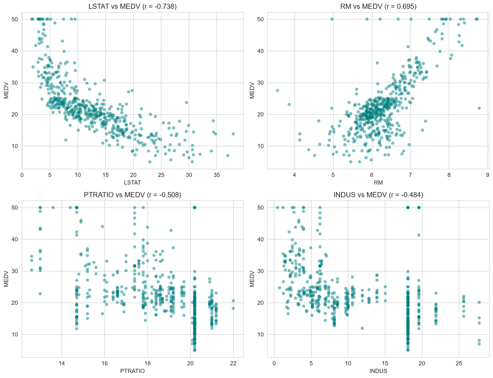
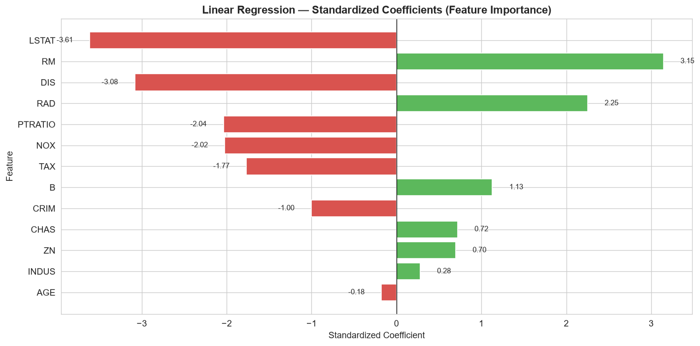
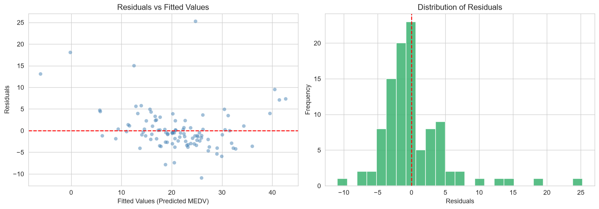
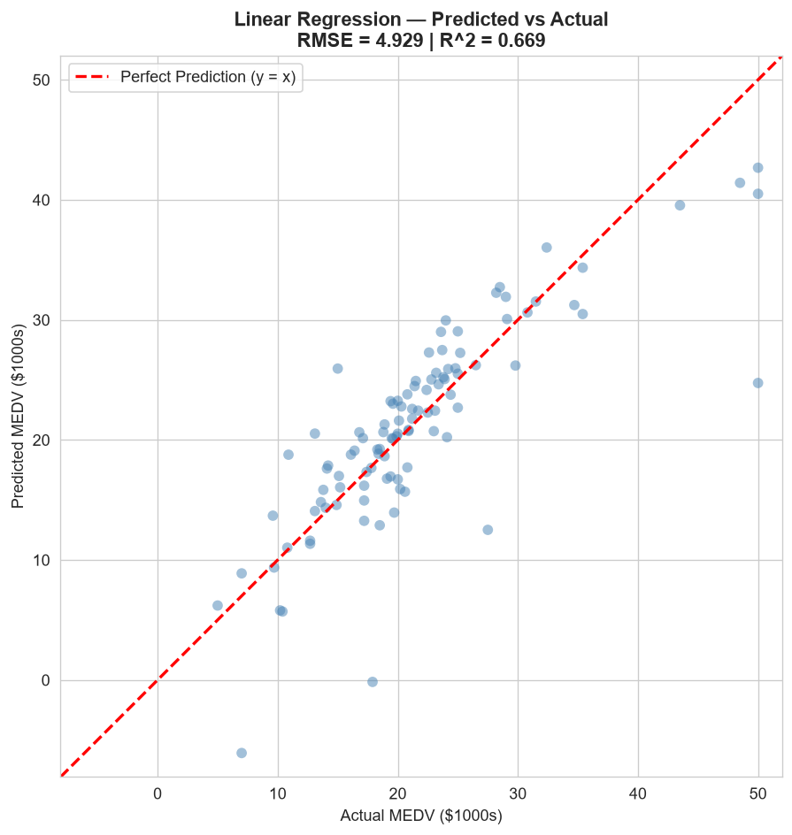
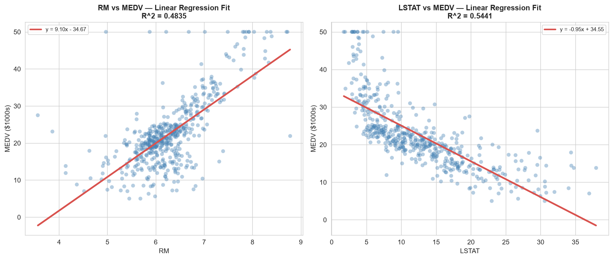
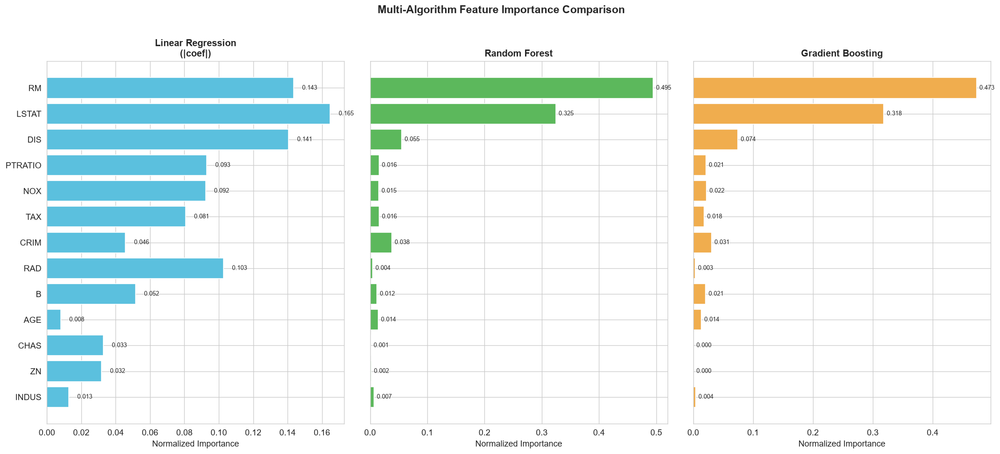
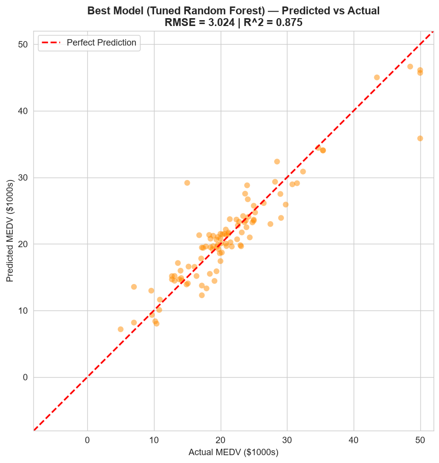
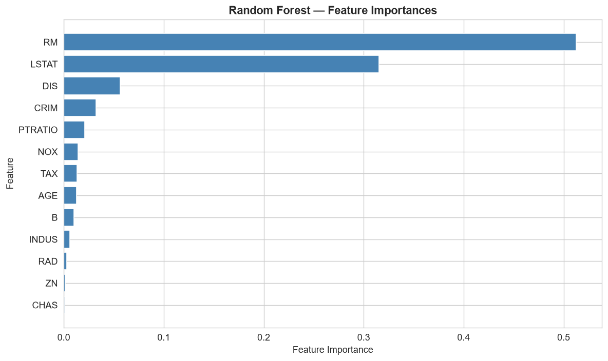

# Boston Housing Price Prediction — Analysis Report

## 1. Dataset Overview

The Boston Housing dataset contains **506 census tracts** from the Boston area with **13 features** describing socioeconomic, environmental, and structural characteristics. The target variable **MEDV** is the median value of owner-occupied homes in thousands of dollars.

| Statistic | MEDV |
|-----------|------|
| Mean | 22.53 |
| Median | 21.20 |
| Std Dev | 9.20 |
| Min | 5.00 |
| Max | 50.00 |

No missing values are present in the dataset.

---

## 2. Exploratory Data Analysis

### 2.1 Correlation Heatmap

- **RM** (average rooms per dwelling) has the strongest positive correlation with MEDV (`r = 0.70`).
- **LSTAT** (% lower status population) has the strongest negative correlation (`r = -0.74`).
- **PTRATIO** (pupil-teacher ratio) also shows notable negative correlation (`r = -0.51`).

### 2.2 Target Distribution

The MEDV distribution is roughly normal with a slight right skew. There is a visible spike at the capped maximum value of 50.0 (originally censored data in the survey).

### 2.3 Top Features vs MEDV

- **RM vs MEDV**: Clear positive linear trend — more rooms strongly associated with higher prices.
- **LSTAT vs MEDV**: Strong negative nonlinear relationship; the effect is steeper at lower LSTAT values.
- **PTRATIO vs MEDV**: Negative relationship — higher student-teacher ratios correlate with lower home values.

---

## 3. Linear Regression (Baseline)

A standard linear regression was fitted on standardized features (80/20 train-test split, `random_state=42`).

| Metric | Value |
|--------|-------|
| **RMSE** | 4.929 |
| **MAE** | 3.189 |
| **R^2** | 0.669 |

### 3.1 Standardized Coefficients

- **LSTAT** has the largest negative coefficient, confirming it as the dominant downward driver.
- **RM** has the largest positive coefficient.
- **RAD** (accessibility to radial highways) and **TAX** (property tax rate) show smaller but notable effects.

### 3.2 Residual Analysis

- Residuals are approximately normally distributed around zero.
- Some heteroscedasticity is visible — variance increases at higher fitted values.
- A few outliers exist at the low end of predictions.

### 3.3 Predicted vs Actual

- The model tends to **over-predict low values** and **under-predict high values**, especially the capped $50,000 observations.
- The 45° reference line shows reasonable alignment but with clear room for improvement.

### 3.4 Linear Regression Fit Lines

Simple linear regression on the two strongest individual predictors:

- **RM (Rooms)**: Each additional room is associated with a **$9,102** increase in median home value. The linear relationship is strong (R^2 = 0.484), though variance increases at higher room counts.
- **LSTAT (% Lower Status)**: Each 1% increase in lower-status population is associated with a **$950** decrease in median home value. The relationship is the strongest single predictor (R^2 = 0.544) but exhibits a clear nonlinear curve — the effect is steeper at the lower end of LSTAT.

These single-feature regressions highlight why the full multivariate model gains from combining both signals: RM and LSTAT together explain far more variance than either alone.

---

## 4. Multi-Model Comparison

Six regression models were compared on the test set with 5-fold cross-validation:

| Model | Test RMSE | Test MAE | Test R^2 | CV RMSE (mean) | CV RMSE (std) |
|-------|-----------|----------|----------|----------------|---------------|
| **Gradient Boosting** | **2.445** | **1.858** | **0.918** | 3.645 | 0.691 |
| Random Forest | 2.915 | 2.047 | 0.884 | 3.847 | 0.525 |
| Linear Regression | 4.929 | 3.189 | 0.669 | 4.829 | 0.575 |
| Ridge (alpha=1.0) | 4.931 | 3.186 | 0.668 | 4.829 | 0.575 |
| ElasticNet (alpha=0.1) | 5.020 | 3.192 | 0.656 | 4.871 | 0.572 |
| Lasso (alpha=0.1) | 5.065 | 3.242 | 0.650 | 4.886 | 0.579 |

**Key findings:**
- Tree-based ensemble methods dramatically outperform linear models on this dataset.
- Regularization (Ridge/Lasso/ElasticNet) does **not** improve over plain Linear Regression — suggesting the dataset is not suffering from multicollinearity at this scale.
- Gradient Boosting achieved the best raw test score, but the CV RMSE standard deviation indicates potential overfitting to the test split.

### 4.1 Multi-Algorithm Feature Importance

Comparing normalized feature importance across three algorithms side-by-side:

- **LSTAT** and **RM** are the dominant features across all three models — confirming their universal predictive power.
- **Linear Regression** spreads importance more evenly across features (e.g., PTRATIO, DIS, RAD all get moderate weight), while tree-based models concentrate heavily on the top 2-3 features.
- **NOX**, **DIS**, and **CRIM** are the clear secondary tier across all methods.
- **CHAS**, **ZN**, **INDUS**, and **AGE** are consistently ranked as the least important features by all three algorithms.

---

## 5. Best Model — Tuned Random Forest

A `GridSearchCV` with 5-fold cross-validation was applied to `RandomForestRegressor`:

| Parameter | Best Value |
|-----------|-----------|
| `n_estimators` | 100 |
| `max_depth` | 10 |
| `min_samples_split` | 2 |
| `min_samples_leaf` | 2 |

| Metric | Value |
|--------|-------|
| **CV RMSE** | 3.810 |
| **Test RMSE** | 3.024 |
| **Test R^2** | 0.875 |
| **Improvement over LR** | **+38.64%** |

### 5.1 Predicted vs Actual (Best Model)

The tuned Random Forest shows significantly tighter clustering around the identity line compared to linear regression. It handles the upper-capped $50,000 observations better, though some systematic error remains.

### 5.2 Feature Importances

Random Forest confirms the same top drivers found in the linear model:
1. **LSTAT** — dominant predictor of home value
2. **RM** — second most important feature
3. **DIS**, **CRIM**, **NOX**, **PTRATIO** — moderate importance
4. **ZN**, **INDUS**, **CHAS**, **AGE** — low importance

---

## 6. Conclusion

- **Best performing approach**: Tree-based ensemble (Gradient Boosting / Random Forest) with RMSE ~2.5–3.0 and R^2 > 0.87.
- Linear models serve as a solid baseline (R^2 ~0.67) but fail to capture the nonlinear relationships between features like LSTAT/RM and housing prices.
- The capped MEDV at $50,000 creates a ceiling effect that all models struggle with — additional feature engineering or a censored regression approach could help.
- Regularization (Ridge/Lasso) provides negligible benefit, indicating the dataset is well-conditioned.
